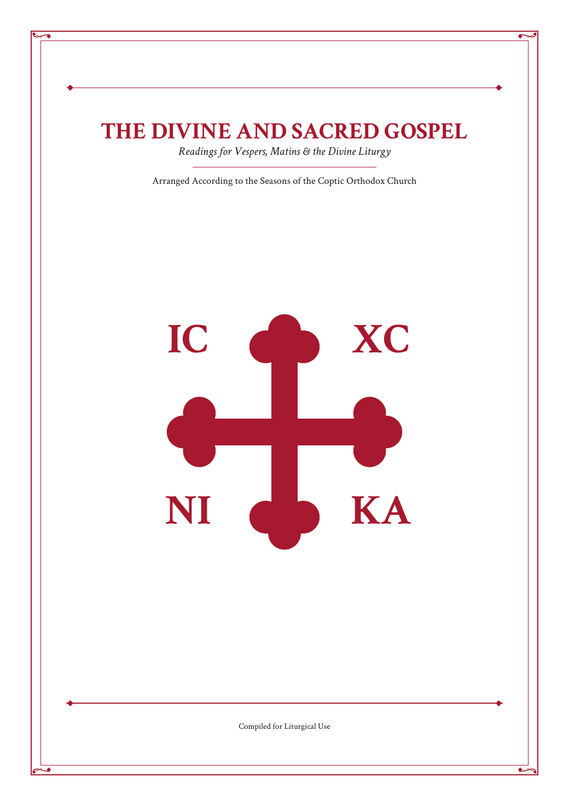
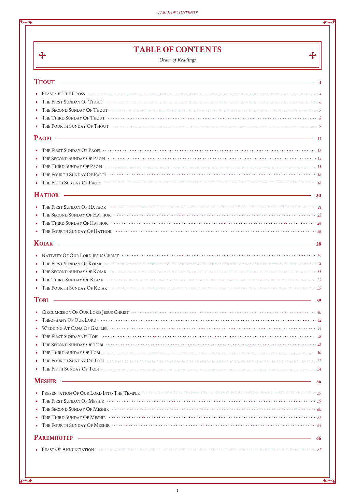
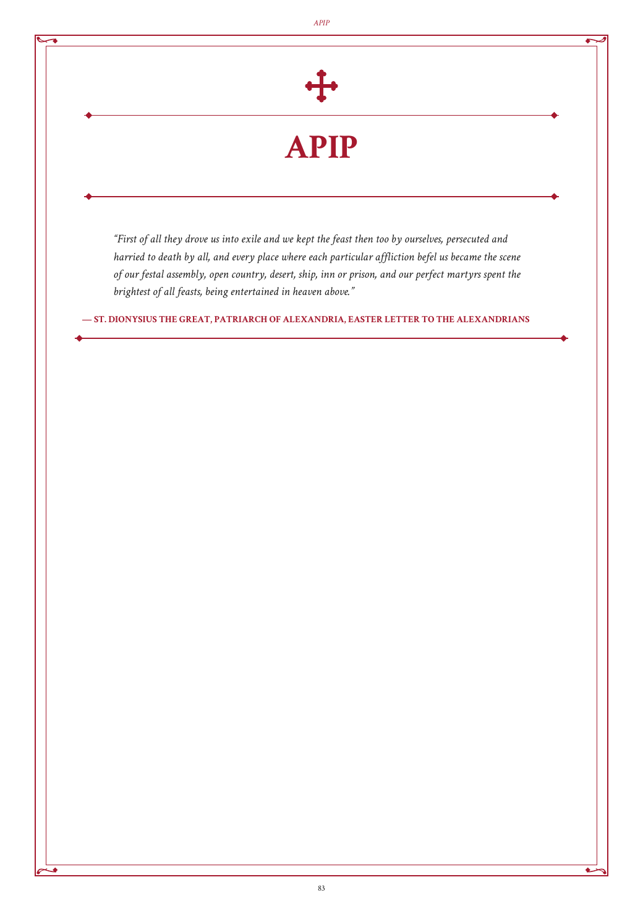
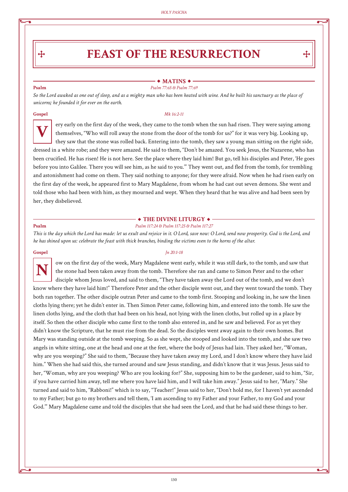

# evangelion

A generator for **The Divine and Sacred Gospel** — a print-friendly Coptic
Orthodox Gospel lectionary booklet, typeset with red rubric headers, a
restrained red/black line-art border, illuminated drop-cap Gospel incipits,
and a Coptic cross motif throughout. Output is a single PDF, trimmed to
24×34cm to fit inside a bound Gospel case.

## What it looks like

|                                                             |                                                 |
| ----------------------------------------------------------- | ----------------------------------------------- |
|                    |   |
|  |  |

## Requirements

- Python 3.14+
- [uv](https://docs.astral.sh/uv/)

## Quick start

```sh
uv sync

# Seed .cache/offline.sqlite3 -- the full real lectionary year, with real
# public-domain translation text for every reading. Needs network access
# once, to fetch each translation; cached after that.
uv run evangelion-seed-offline

# Build the book from it. No network access from here on.
uv run evangelion
```

This writes `output/the_holy_gospel_sundays.pdf` (override with `--output`).
Pass `--every-day` to print every day of the year instead of just Sundays
and Major/Minor Feasts (see "How it's organized") -- writes
`output/the_holy_gospel_all.pdf` by default instead.

## How it's organized

By default, occasions are every Sunday plus every Major/Minor Feast in the
lectionary year (a handful of fast-_start_ markers that just land on an
arbitrary weekday — e.g. the start of the Fast of Nineveh — are left out,
since they aren't a commemoration in their own right); pass `--every-day`
to include every single day instead, each ordinary weekday titled by its
own Coptic day (e.g. "Thout 4"). Either way, occasions fall in two
sections: the **Fixed Cycle**, one divider per Coptic month, for
everything dated by the fixed Coptic calendar; then the **Moveable
Cycle**, a trailing section for Great Lent, Holy Pascha, and Pentecost —
dated by the Paschalion instead, so their Coptic day drifts year to year
and doesn't belong filed under whichever month it happens to land in that
year. The Table of Contents is generated from this same data.

Only the Psalm and Gospel of each service (Vespers, Matins, the Divine
Liturgy) are set.

Key modules, under `src/evangelion/`:

| Module                   | Purpose                                                                            |
| ------------------------ | ---------------------------------------------------------------------------------- |
| `generate.py`            | Builds the PDF: page layout, Table of Contents, occasion pages.                    |
| `seed_offline_db.py`     | Builds `.cache/offline.sqlite3` from hardcoded lectionary structure + real translation text. |
| `bible_source.py`        | Looks up verse text from UKJV, KJV, ASV, WEB, and Brenton's Septuagint; splits a multi-book Gospel harmony reading (e.g. Palm Sunday's) back into separately labeled readings. |
| `psalm_numbering.py`     | Converts a Psalm reference to Septuagint numbering for display.                    |
| `festal_letters.py`      | The Festal Letter excerpt shown on each month-divider page.                        |
| `layout.py` / `fonts.py` | Drawing primitives (page frame, cross, headpiece, drop cap) and font registration. |

## Running the tests

```sh
uv run pytest
```

`tests/test_offline_scripture.py` checks every reading `offline.sqlite3`
renders against the real translation text its own reference claims to
quote, via `bible_source.py`. The first run downloads and caches each
translation's zip under `.cache/` (git-ignored); later runs reuse those
cached copies.

`tests/test_katameros_validation.py` cross-checks the seeded lectionary
data against a pre-extracted snapshot of the real printed Katameros book
(`tests/katameros_reference.json`, committed -- no live download needed).

## Licensing

This project's own source code is MIT-licensed (see `LICENSE`). That does
**not** extend to everything the book assembles at build time:

- **Crimson Text**, the body typeface, is bundled under the SIL Open Font
  License 1.1 (`src/evangelion/fonts/OFL.txt`).
- The Festal Letter excerpts (`festal_letters.py`) are public-domain
  19th-century translations (St. Athanasius, St. Peter I) or used under
  CC BY-NC-SA 4.0 with attribution (St. Alexander I) — see that module's
  docstring for full sourcing per quote.
- The lectionary database (`.cache/offline.sqlite3`, built by
  `seed_offline_db.py`, not committed) carries the real lectionary year's
  Psalm/Gospel assignments, with real public-domain translation text for
  each reading:
  - **Psalms** default to Brenton's English Septuagint (1851, as
    LXX2012 -- Michael Paul Johnson's 2012 American-English update;
    public domain, ebible.org) — a translation of the actual Greek
    Septuagint the Coptic Church's Psalter uses, so it's already
    numbered the way this
    book displays every Psalm reference (see `psalm_numbering.py`), with
    no Masoretic-to-Septuagint conversion needed for the text itself, only
    the printed reference. A handful of references that fall inside the
    two chapters Septuagint numbering splits one Masoretic psalm across
    fall back to UKJV instead (see `seed_offline_db.py`'s docstring).
  - **Gospels** default to the World English Bible (Updated edition,
    public domain, ebible.org), a modern-language translation.
  - The Updated King James Version (UKJV, a public-domain modernization
    of the 1769 KJV, creationism.org/BibleUKJV/), the classic King James
    Version (1769 standard text, ebible.org), and the ASV (1901,
    ebible.org) are available as alternative Gospel sources, and
    KJV/UKJV/WEB as alternative Psalm sources — pass
    `--psalm-source`/`--gospel-source` to `evangelion-seed-offline`.

## Development notes

- The lectionary structure (which occasions exist, which season/divider
  each belongs to, which Psalm/Gospel reference belongs to which service)
  is hardcoded in `seed_offline_db.py`, extracted once from a real scan of
  the Coptic Orthodox Church's published daily readings plus the printed Katameros
  book -- see that module's docstring for full provenance. Rebuilding
  `.cache/offline.sqlite3` (`uv run evangelion-seed-offline`) only
  re-fetches translation *text* for that fixed structure; it never
  touches the network for the structure itself.
- Built PDFs go under `output/`; downloaded translation zips and any
  differently-seeded database go under `.cache/` -- both git-ignored,
  neither meant to be committed.
